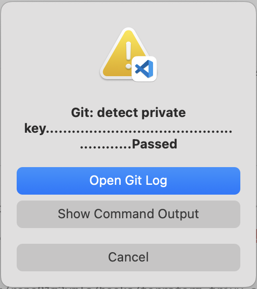
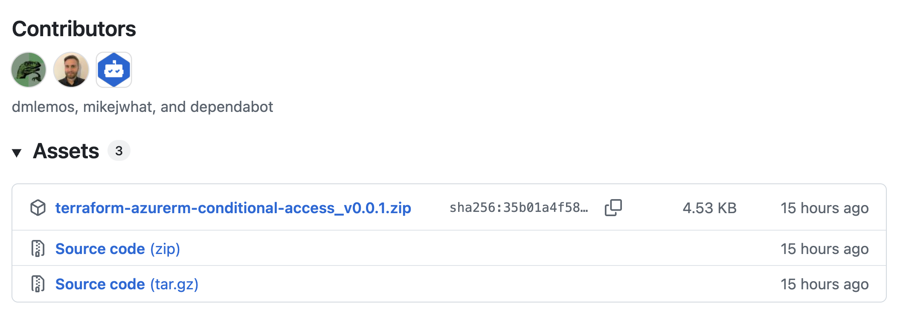

# gds-entra-infrastructure-modules

Repo where we store reusable terraform modules for the gds-entra solution.

## Developer Onboarding

1. This repository uses pre-commit. Please install prerequisite tools first:

```zsh
brew install tflint checkov trivy terraform-docs codespell
```

> [!IMPORTANT]
> Make sure the Homebrew path is included in the PATH environment variable in your default shell (probably Zsh on MacOS).

2. Then complete steps 1. and 3. from the [pre-commit quick start](https://pre-commit.com/#quick-start).

If pre-commit detects issues when you attempt to commit changes, a dialogue box similar to the one below will appear. Click 'Show Command Output' to see details:



> [!IMPORTANT]
> README.md files for each module were created, and are maintained by terraform-docs. A pre-commit hook is configured to run this utility automatically; you can also run it manually as shown below:

```zsh
terraform-docs markdown table --indent 2 --output-mode inject --output-file README.md ./terraform-azurerm-<module name suffix>
```

## Releasing Individual Modules

To release a new version of a specific module, create and push a git tag matching the module's directory name and desired version. For example, to release version 0.0.1 of the `azurerm-conditional-access` module, you would run the commands below from the root of the checked out repository:

```sh
git tag azurerm-conditional-access/v0.0.1 -m 'Initial release'
git push origin azurerm-conditional-access/v0.0.1
```

This will trigger the release workflow for that module only. Each module should be tagged and released independently using this pattern.

## Consuming Modules

1. On the [Releases page](https://github.com/alphagov/gds-engineering-access-terraform-modules/releases), find your desired module/version combination, ensure the Assets drop-down list is expanded, then right click the module asset (azurerm-conditional-access_v0.0.1.zip in this case) and select 'Copy Link':



2. Use this URI in the module source argument:

```hcl
module "azurerm-conditional-access" {
  source = "https://github.com/alphagov/gds-engineering-access-terraform-modules/releases/download/azurerm-conditional-access%2Fv0.0.1/azurerm-conditional-access_v0.0.1.zip"
  #...
}
```
